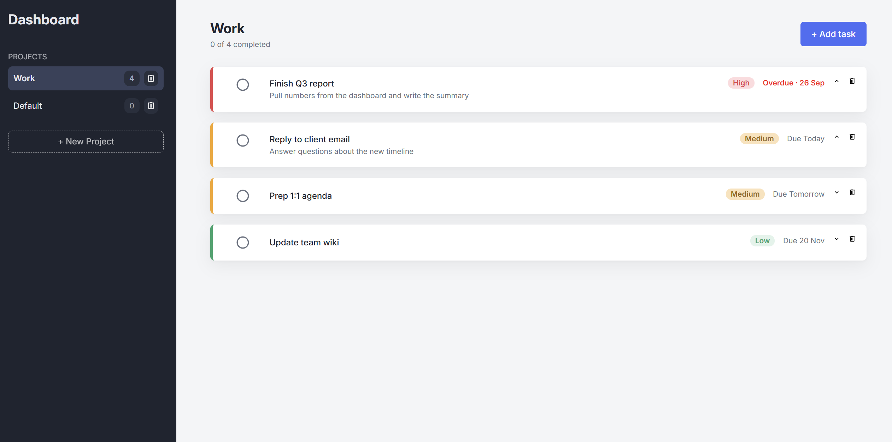

# Todo List

A task manager built with vanilla JavaScript, organized into projects and persisted in the browser so your tasks survive a page reload. Create projects, add todos with due dates and priorities, mark them complete, and come back later to find everything exactly where you left it.

**[Live demo →](https://dani-sink.github.io/todo-list/)**



## Features

- **Projects** — organize todos into separate lists; a default project is created on first load
- **Todos** — each has a title, description, due date, and priority (high / medium / low)
- **Priority color-coding** — tasks are visually color-coded by priority at a glance
- **Due dates & overdue state** — overdue tasks are highlighted
- **Complete / expand / delete** — toggle a task done, expand it to read its details, or remove it
- **Persistent storage** — everything is saved to `localStorage` automatically and restored on reload

## What it demonstrates

- **Modular architecture** — application logic is kept entirely separate from DOM manipulation, split across dedicated modules (todos, projects, a controller, storage, helper functions, and rendering)
- **Factory functions** for creating todo and project objects
- **`localStorage` + JSON** — serializing app state with `JSON.stringify`, restoring it with `JSON.parse`, and rehydrating plain data back into working objects (methods and all)
- **ES6 modules** bundled with **webpack**

## Built with

- Vanilla JavaScript (ES6 modules)
- Webpack (split dev / prod config via webpack-merge)
- HTML & CSS (custom properties for theming)
- `localStorage` for persistence

## Running locally

```bash
git clone https://github.com/dani-sink/todo-list.git
cd todo-list
npm install
npm run dev      # starts the dev server at localhost:8080
```

To create a production build:

```bash
npm run build    # outputs to dist/
```

## What I learned

- Separating logic from the DOM made the whole thing easier to test and reason about.
- The localStorage rehydration trick: Since parsed objects lose their methods, they have to be rebuilt through the factories before being used again.
- Testing each factory layer (todo -> project -> controller) in the console before writing any UI allowed me to completely focus on implementing functionality first before thinking of writing any UI.
- Writing manual test cases allowed me spot errors quickly in the buildup.
- Separating everything into modules allowed my code to be clearer and more readable.

## What I'd improve next

- Edit an existing todo (currently create + delete only)
- A cross-project "Today" / "This week" view
- try/catch hardening around storage for private-browsing edge cases
